<!--
============================================================
  README FUTURISTA PARA PERFIL DE GITHUB — "NEXO DE DATOS"
  Paleta: Opción A - Ciberpunk Minimalista
          Negro profundo · Neón Azul (#00c8ff) · Neón Púrpura (#bd00ff)

  INSTRUCCIONES:
  Busca y reemplaza en TODO el archivo:
    [MI_USUARIO_DE_GITHUB]   -> tu nombre de usuario real de GitHub
    [MI_NOMBRE_O_ALIAS]      -> tu nombre o alias
    [MI_LINKEDIN]            -> tu usuario de LinkedIn
    [MI_INSTAGRAM]           -> tu usuario de Instagram
    [MI_PORTAFOLIO_URL]      -> la URL de tu portafolio
    [MI_WAKATIME_USERNAME]   -> tu usuario de WakaTime (si lo usas)

  Este archivo ya viene poblado con datos de ejemplo del
  desarrollador ficticio "futurist-user" para que veas el
  resultado final antes de personalizarlo.
============================================================
-->

<div align="center">

<!-- ============ BANNER PRINCIPAL ============ -->
<!-- Banner generado con capsule-render: temática espacial/nave despegando -->
<!-- Puedes editar el texto y los colores en https://github.com/kyechan99/capsule-render -->


<br/>

<!-- ============ EFECTO DE ESCRITURA DINÁMICA (typing-svg) ============ -->
<!-- Genera/edita el tuyo en https://readme-typing-svg.demolab.com -->
<a href="#">
  
</a>

<br/>

<!-- Separador visual estilo circuito -->


</div>

<br/>

<!-- ============ SOBRE MÍ ============ -->
<div align="center">


</div>

```yaml
user:      "Sayder Jr Carreño"
alias:     "Saydco"
role:      "Software Developer"
location:  "Low Earth Orbit"

about_me: 
> Frontend-focused developer passionate about crafting dynamic interfaces, clean code, and web experiences that not only perform flawlessly, but also feature a strong visual identity.

interests:
  - "🖥️  Frontend y Diseño UI"
  - "🤖  Inteligencia Artificial"
  - "🟢  Freelance"
  - "📋  Looking for contract-based"

current_status: "Compiling projects in zero gravity"
```

<div align="center">

</div>

<br/>

<!-- ============ TECNOLOGÍAS ============ -->
<div align="center">

## ⚙️ &nbsp; STACK_TECNOLOGICO.json

<br/>

<!-- Insignias generadas con shields.io + simple-icons, estilo "for-the-badge" con paleta neón -->


<br/>


<br/>


</div>

<br/>

<div align="center">

</div>

<br/>

<!-- ============ ESTADÍSTICAS DINÁMICAS ============ -->
<div align="center">

## 📡 &nbsp; TELEMETRIA_EN_VIVO.stream

<br/>

<!-- github-readme-stats: Card de estadísticas generales -->
<!-- Repo del proyecto: https://github.com/anuraghazra/github-readme-stats -->


<!-- github-readme-stats: Card de lenguajes más usados -->


<br/><br/>

<!-- github-readme-streak-stats: Racha de contribuciones -->
<!-- Repo del proyecto: https://github.com/DenverCoder1/github-readme-streak-stats -->


<br/><br/>

<!-- [Opcional] WakaTime: Horas de codificación -->
<!-- Configura tu badge en https://wakatime.com/ luego de instalar el plugin de tu editor -->


<br/><br/>

<!-- Gráfico de actividad de contribuciones (activity graph) -->
<!-- Repo del proyecto: https://github.com/Ashutosh00710/github-readme-activity-graph -->


</div>

<br/>

<div align="center">

</div>

<br/>

<!-- ============ PROYECTOS DESTACADOS ============ -->
<div align="center">

## 🚀 &nbsp; MODULOS_DESTACADOS.launch

<br/>

<!-- Tarjetas de repositorio generadas automáticamente vía github-readme-stats/pin -->
<a href="https://github.com/futurist-user/orbital-api">
  
</a>
<a href="https://github.com/futurist-user/nexus-dashboard">
  
</a>

<br/>

<a href="https://github.com/futurist-user/quantum-chain">
  
</a>
<a href="https://github.com/futurist-user/void-engine">
  
</a>

</div>

<br/>

<div align="center">

</div>

<br/>

<!-- ============ CONEXIÓN / REDES ============ -->
<div align="center">

## 🛰️ &nbsp; CANALES_DE_COMUNICACION.link

<br/>

<!-- Iconos de simple-icons vía shields.io, estilo circular con fondo negro -->
<a href="https://www.linkedin.com/in/futurist-user" target="_blank">
  
</a>
<a href="https://www.instagram.com/futurist.user" target="_blank">
  
</a>
<a href="https://futurist-user.dev" target="_blank">
  
</a>

</div>

<br/>

<div align="center">

</div>

<br/>

<!-- ============ PIE DE PÁGINA ============ -->
<div align="center">

### 🌌 &nbsp; *"El código es el único lenguaje universal para construir futuros que aún no existen."*

<br/>


<sub>⚡ Generado con propulsión neón · Última sincronización: en tiempo real ⚡</sub>

</div>